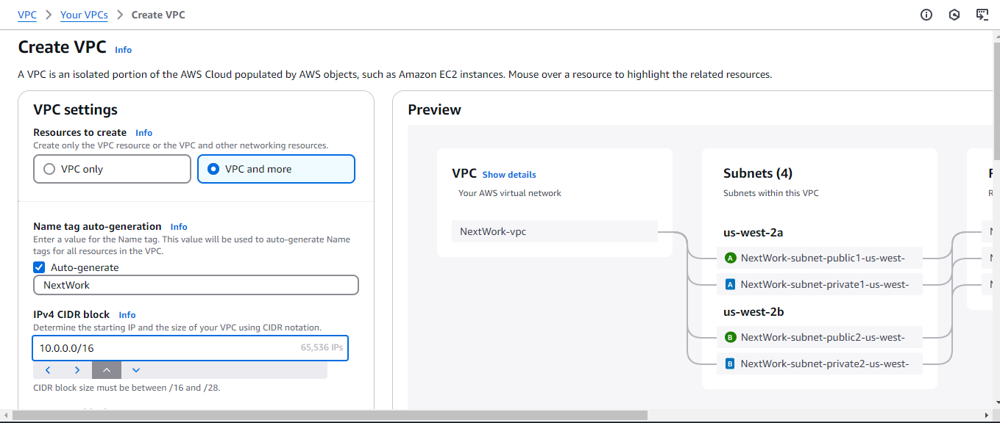
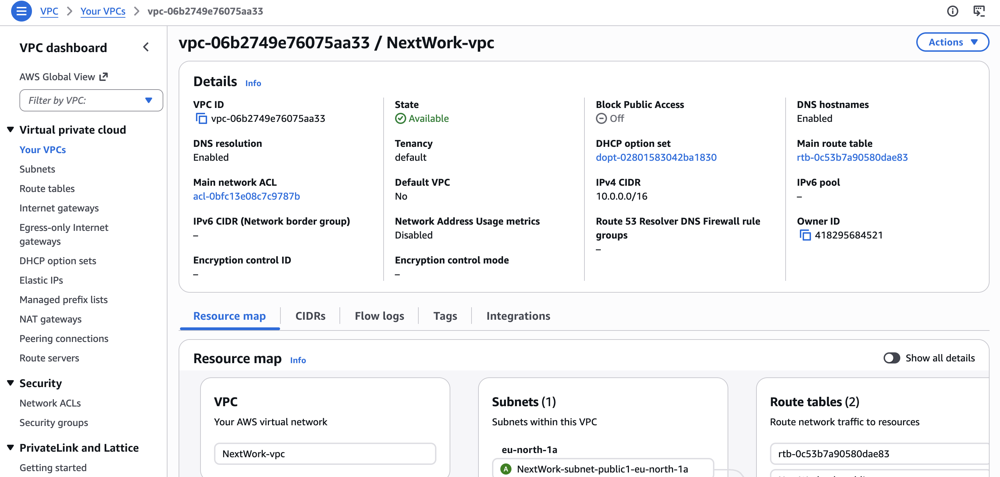
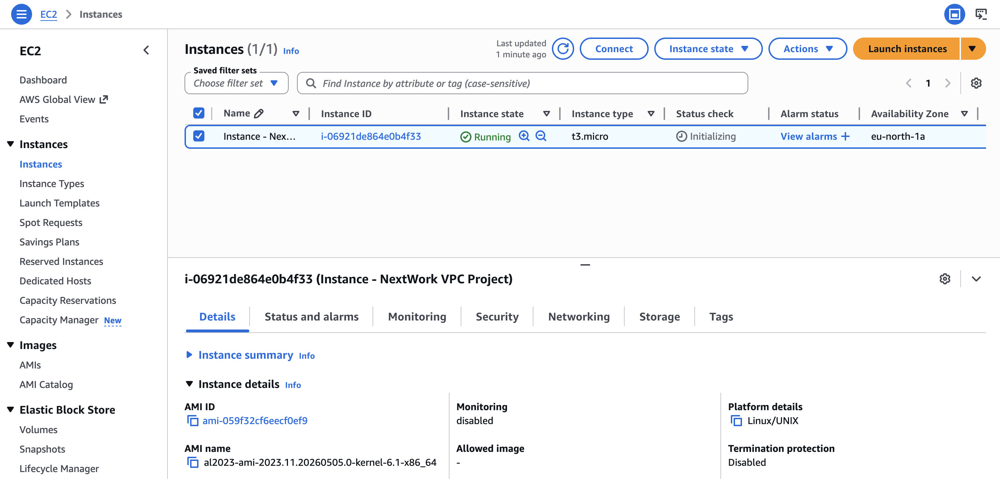
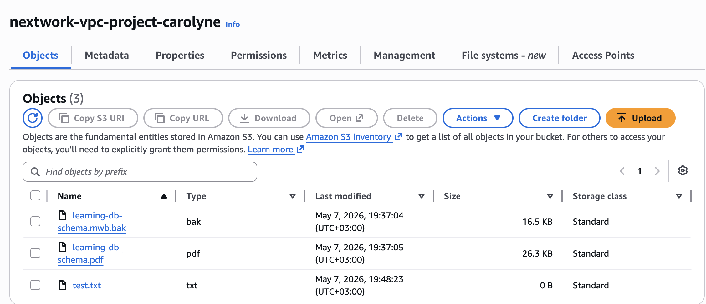
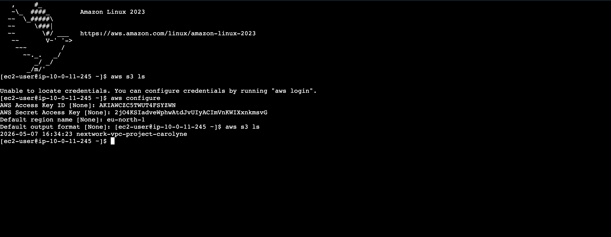

# AWS Hands-On Projects

## Overview
This repository showcases my hands-on experience with Amazon Web Services (AWS), where I have worked on core cloud services including compute, storage, and networking.

Through these projects, I have gained practical skills in deploying cloud infrastructure, managing storage, and understanding secure network configurations.

##  Project 1: Launching an EC2 Instance

### Description
In this project, I launched and configured an Amazon EC2 instance to understand how cloud-based virtual servers are deployed and managed.

### Key Learnings
- Instance creation and configuration
- Connecting to a virtual server
- Understanding cloud compute services

##  Project 2: Creating and Managing an S3 Bucket

### Description
In this project, I created and managed an Amazon S3 bucket to explore cloud storage and how data is stored and accessed in AWS.

### Key Learnings
- Bucket creation and configuration
- Uploading and managing files
- Understanding cloud storage concepts

##  Project 3: Configuring an Amazon VPC

### Description
In this project, I created and configured a Virtual Private Cloud (VPC), including subnets, routing, and internet connectivity.

### Key Learnings
- VPC creation and configuration
- Public subnet setup
- Internet Gateway and route tables
- Basics of cloud networking and security

##  Project 4: Assessing AWS Services through VPC

### Description
In this Project, I used Amazon VPC to establish a private secure connection to Amazon S3

### Key Learnings
- VPC creation and configuration
- Launch EC2 inside the VPC
- Create an S3 bucket and upload objects
- Create access key ID through IAM.
- Connect to AWS services through the CLI

  

##  Skills Demonstrated
- Cloud Computing Fundamentals
- AWS Services (EC2, S3, VPC)
- Basic Cloud Networking
- Infrastructure Setup

##  Next Steps
I am continuing to expand my cloud computing skills by working on more advanced AWS projects and integrating them with software development and AI concepts.

##  Author
Carolyne Cherono
