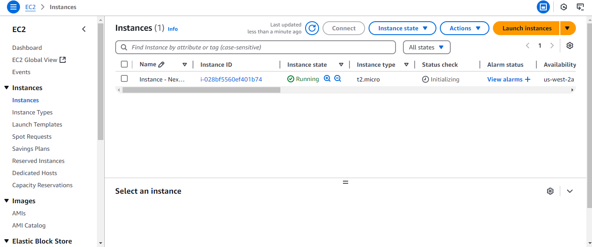
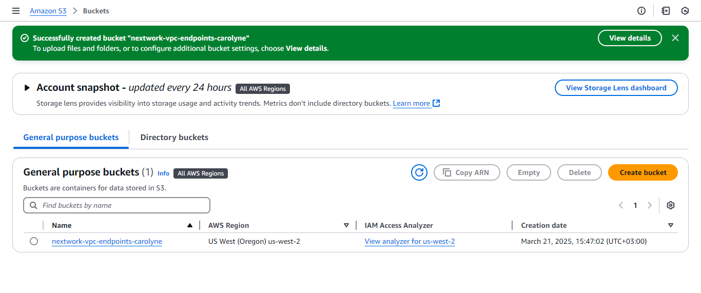

# AWS Hands-On Projects

## Overview
This repository showcases my hands-on experience with Amazon Web Services (AWS), where I have worked on core cloud services including compute, storage, and networking.

Through these projects, I have gained practical skills in deploying cloud infrastructure, managing storage, and understanding secure network configurations.

##  Project 1: EC2 Instance

### Description
In this project, I launched and configured an Amazon EC2 instance to understand how cloud-based virtual servers are deployed and managed.

### Key Learnings
- Instance creation and configuration
- Connecting to a virtual server
- Understanding cloud compute services

### Screenshot

##  Project 2: S3 Bucket

### Description
In this project, I created and managed an Amazon S3 bucket to explore cloud storage and how data is stored and accessed in AWS.

### Key Learnings
- Bucket creation and configuration
- Uploading and managing files
- Understanding cloud storage concepts

### Screenshot

##  Project 3: Amazon VPC Setup

### Description
In this project, I created and configured a Virtual Private Cloud (VPC), including subnets, routing, and internet connectivity.

### Key Learnings
- VPC creation and configuration
- Public subnet setup
- Internet Gateway and route tables
- Basics of cloud networking and security

### Screenshot

##  Skills Demonstrated
- Cloud Computing Fundamentals
- AWS Services (EC2, S3, VPC)
- Basic Cloud Networking
- Infrastructure Setup

##  Next Steps
I am continuing to expand my cloud computing skills by working on more advanced AWS projects and integrating them with software development and AI concepts.

##  Author
Carolyne Cherono
